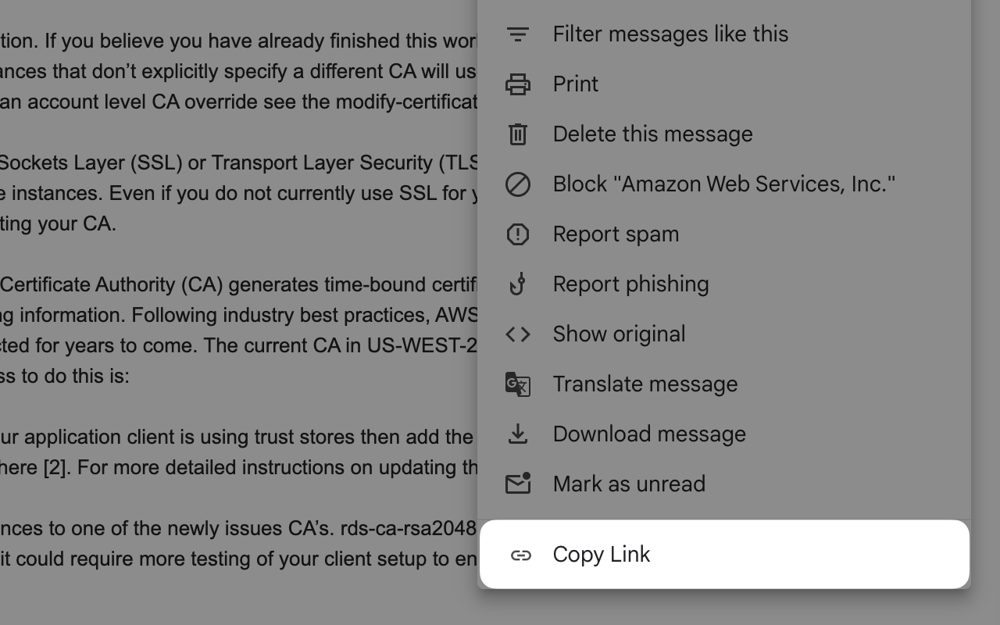

# Gmail Copy Link to Email

A Chrome Extension to add a **Copy Link** button to Gmail messages to copy a direct link back to an email. This is useful when you want a refer back to an email from another tool.

You can install [Gmail Copy Link to Email](https://chromewebstore.google.com/detail/gmail-copy-link-to-email/eacjcbfhakpkfabohdjfcefjfcfhpdao?authuser=0&hl=en) from the Chrome web store.

## Contributing

I encourage pull requests for bug fixes and improvements to the code.

1. Clone this repo
2. Install dependencies with `npm install`
3. Run `npm run start`
4. Follow the Google docs to [Load an unpacked extension](https://developer.chrome.com/docs/extensions/get-started/tutorial/hello-world#load-unpacked) into your browser

Typical flow is:

1. Make a change in code
2. Reload the extension in chrome://extensions/
3. Reload Gmail
4. Test your change

## Publishing

1. Follow [this document](https://developer.chrome.com/docs/webstore/publish) for how to Publish in the Chrome Web Store
2. Bump the version in `./static/manifest.json`
3. Run `npm run build`
4. Upload `dist.zip` file to Chrome Web Store
